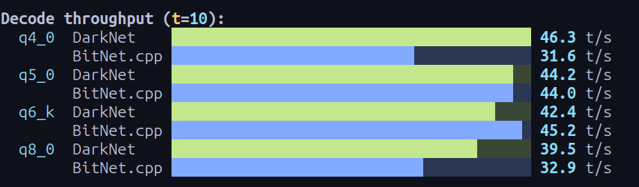
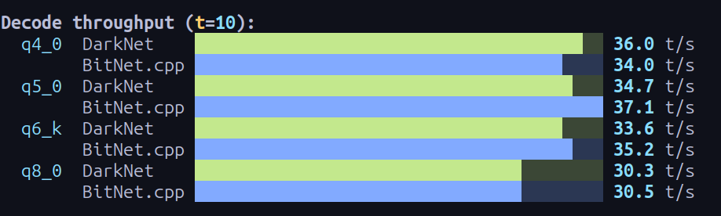
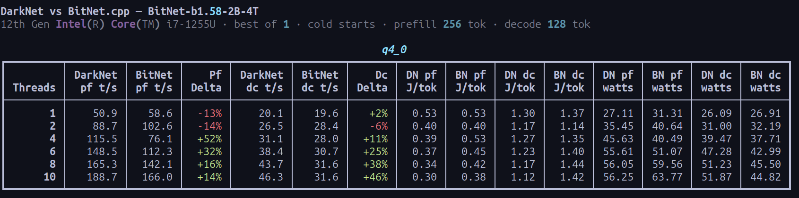
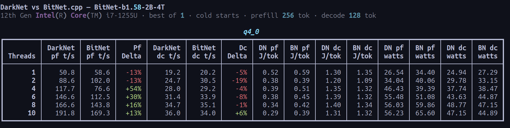
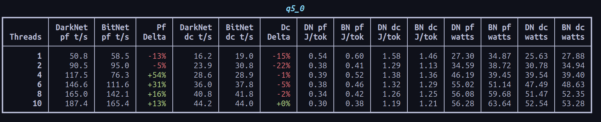
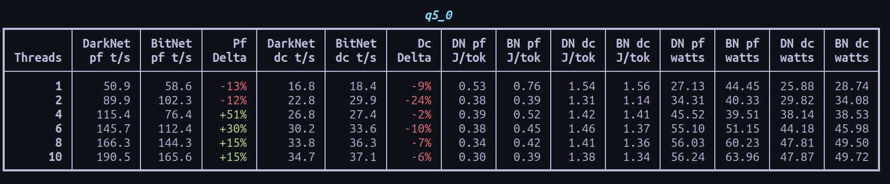
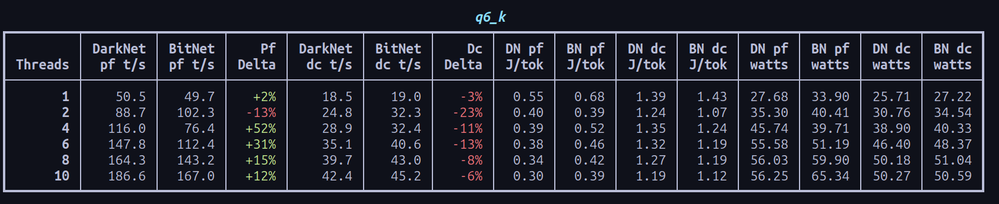
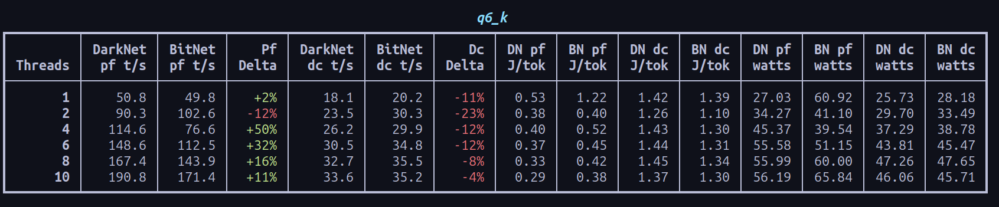
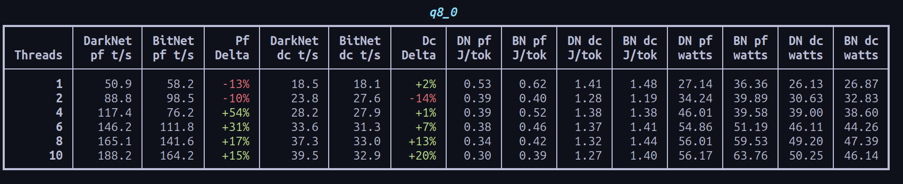
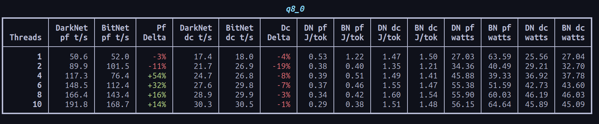

# Benchmarks

This page summarizes consumer CPU comparisons between bitnet.cpp and DarkNet, the inference engine behind Trillim.

## How These Runs Were Collected

All benchmark sessions used the same process:

- Fresh system restart before each benchmark session
- 5 warmup runs for both engines before recording data
- Interleaved execution between engines to reduce time-drift bias
- Cool-down between runs until CPU temperature returned to `45C`

These controls reduce noise, but the results should still be treated as directional.

## Decode Throughput

Run A:

Run B:

Takeaways:

- Decode throughput is broadly comparable to bitnet.cpp.
- DarkNet reaches higher peaks.
- The gap is most visible once `num_threads >= 4`.

## Runtime Quantization

### Q4_0

Run A:

Run B:

### Q5_0

Run A:

Run B:

### Q6_K

Run A:

Run B:

### Q8_0

Run A:

Run B:

## Main Takeaways

- DarkNet tends to pull ahead once the thread count reaches 4 or more.
- Average decode rates are close to bitnet.cpp, but DarkNet shows higher peak throughput.
- Runtime quantization behavior depends heavily on the CPU, thermal budget, and memory subsystem.

## Limits of This Data

- Consumer CPUs vary in boost behavior, thermal limits, and power settings.
- Background processes and OS scheduling can materially affect short runs.
- Memory bandwidth and cache behavior can dominate results as thread count increases.
- SMT and Hyper-Threading behavior differs by CPU generation and workload shape.
- Compiler flags, kernel versions, and microcode updates can shift the results.
- Prompt mix, context length, and warm-up policy also affect measured decode rates.
